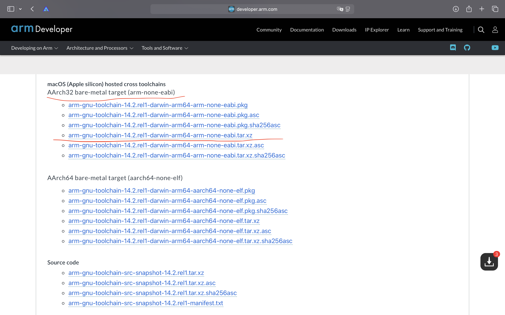
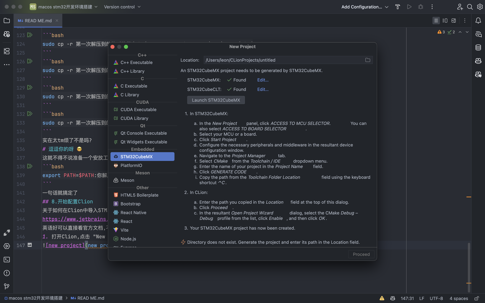
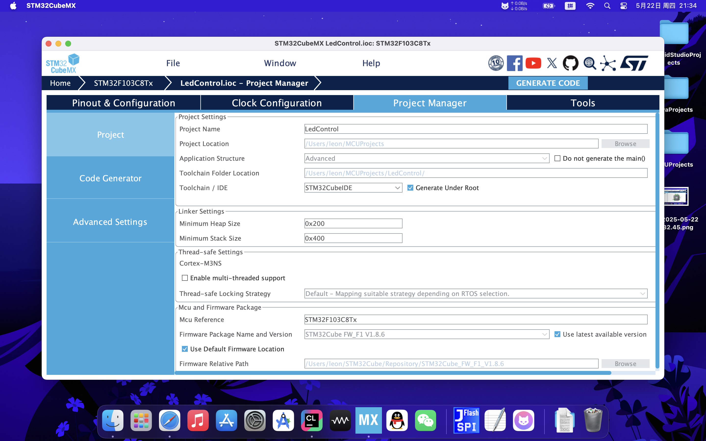
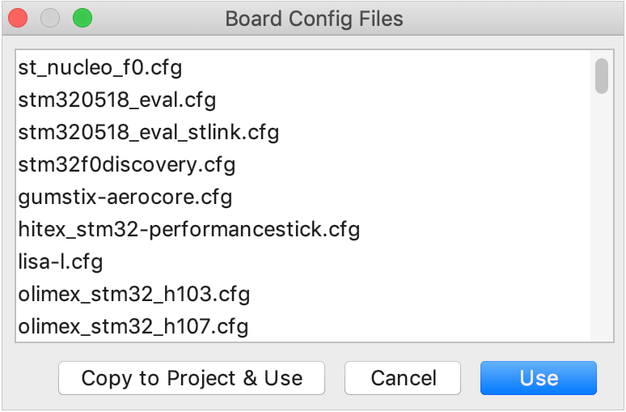
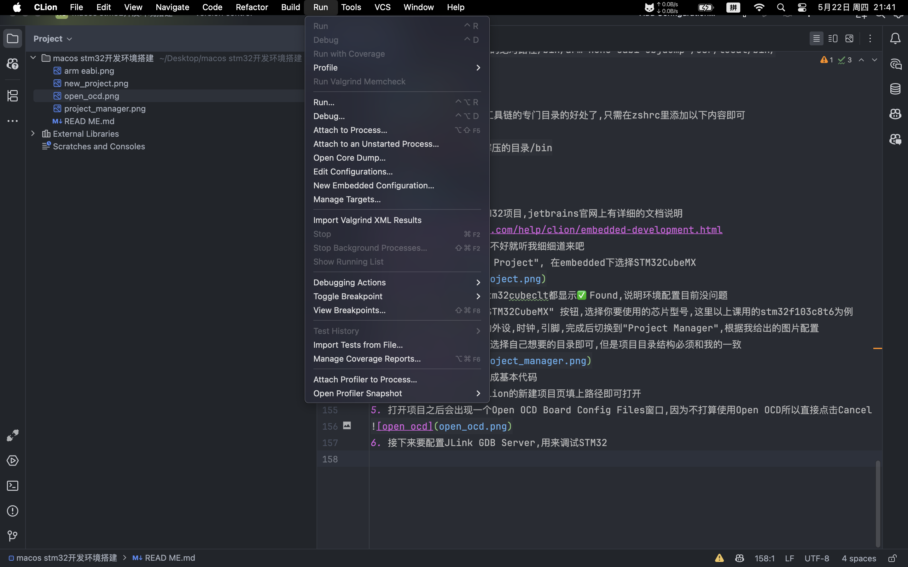
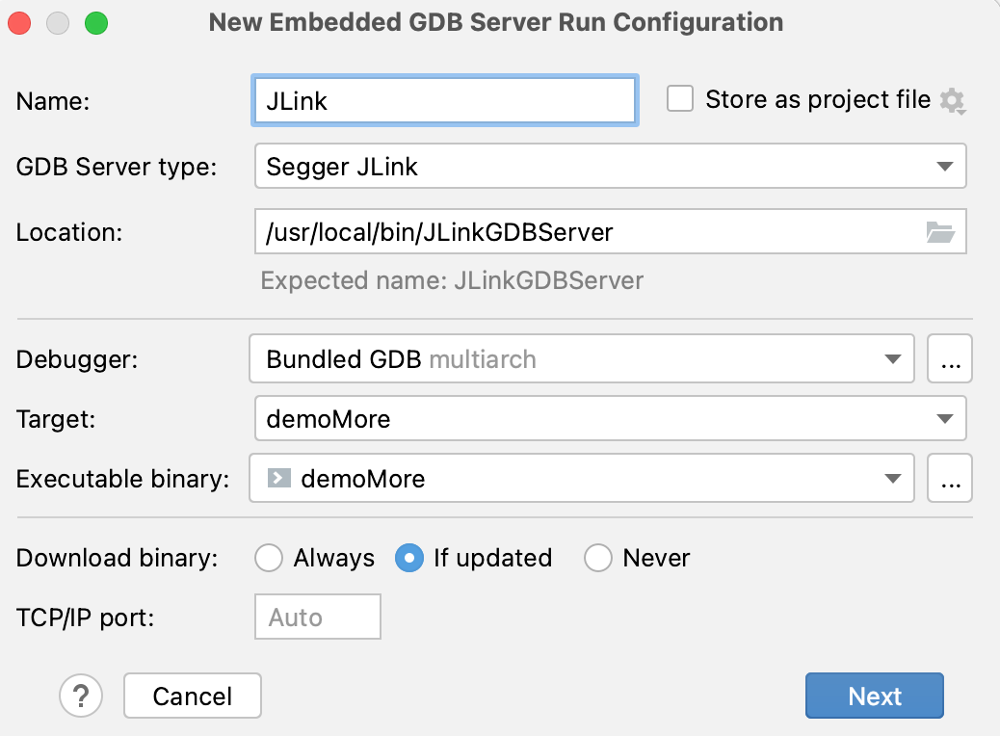
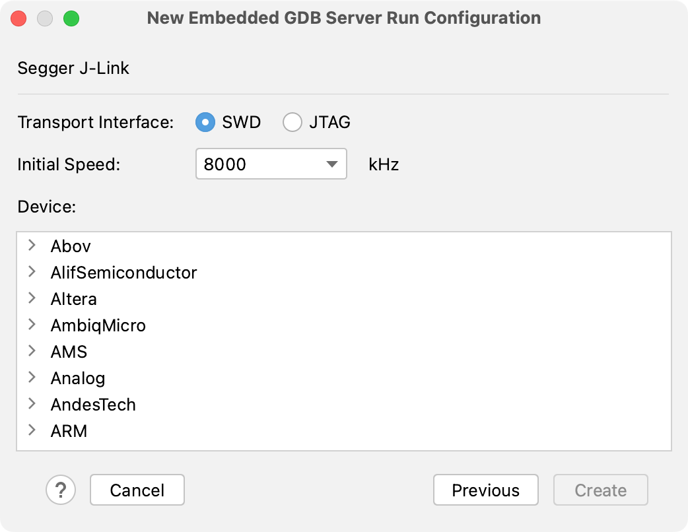
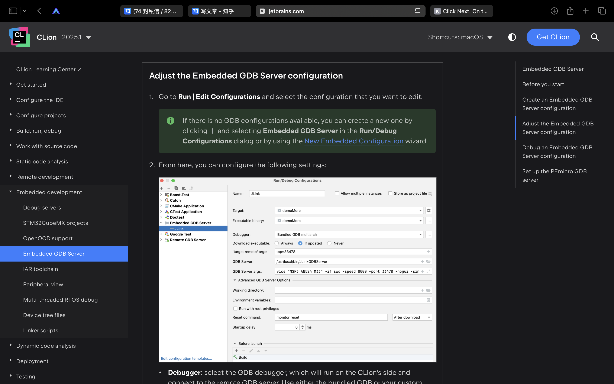
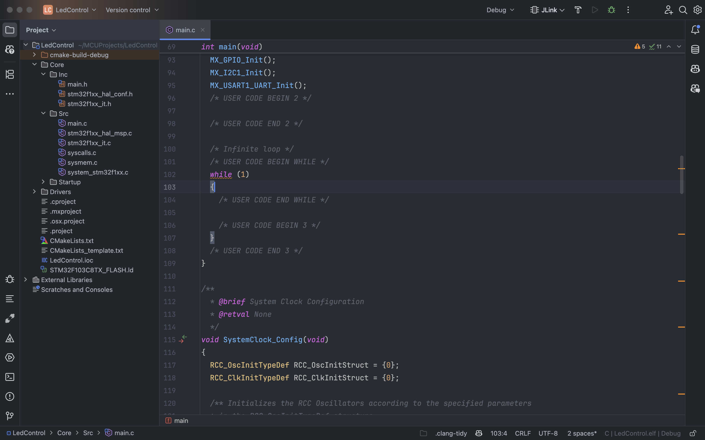
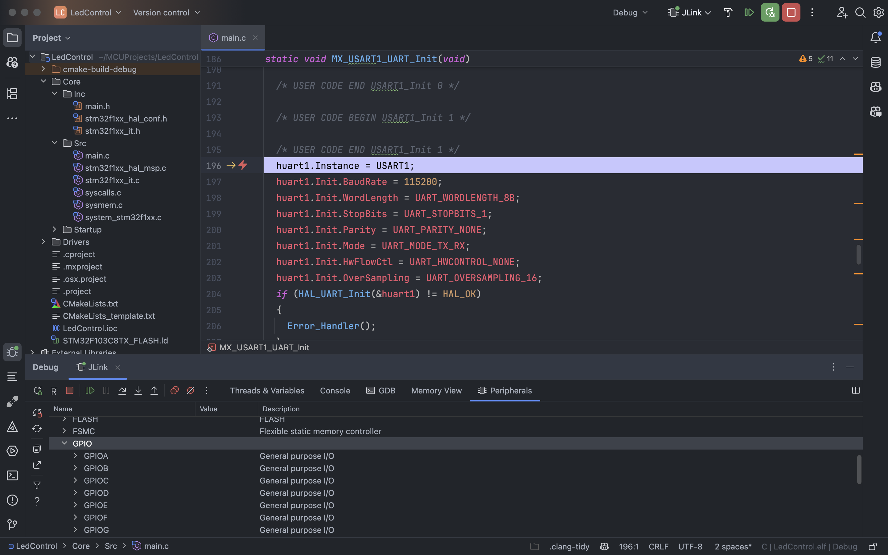

# Macos🀄️STM32开发环境搭建

## 前言

STM32是意法半导体（STMicroelectronics）推出的一系列基于ARM Cortex-M内核的微控制器。 它们广泛应用于嵌入式系统、物联网设备、工业自动化等领域。
STM32系列微控制器具有高性能、低功耗和丰富的外设接口，适合各种应用场景。本教程以stm32f103c8t6为例，介绍如何在macos上搭建STM32开发环境。

## 1. 安装Homebrew

Homebrew是macOS上的一个包管理器，可以方便地安装和管理软件包。打开终端，输入以下命令安装Homebrew：

```bash
/bin/bash -c "$(curl -fsSL https://raw.githubusercontent.com/Homebrew/install/HEAD/install.sh)"
```

安装完成后，运行以下命令更新Homebrew：

```bash
brew update
```

由于某些不能说的原因,在某些不能说的地区直接安装或更新会非常慢甚至失败,所以我们可以使用大陆的镜像源来加速安装和更新。以下是一些常用的镜像源：

- 清华大学镜像源

```bash
export HOMEBREW_BOTTLE_DOMAIN=https://mirrors.tuna.tsinghua.edu.cn/homebrew-bottles
```

- 中科大镜像源

```bash
export HOMEBREW_BOTTLE_DOMAIN=https://mirrors.ustc.edu.cn/homebrew-bottles
```

- 阿里云镜像源

```bash
export HOMEBREW_BOTTLE_DOMAIN=https://mirrors.aliyun.com/homebrew/bottles
```

这些镜像源可以在终端中运行以下命令来设置：

```bash
vim ~/.zshrc
```

在文件末尾添加以下内容：

```bash
export HOMEBREW_BOTTLE_DOMAIN=https://mirrors.tuna.tsinghua.edu.cn/homebrew-bottles
```

保存并退出后，运行以下命令使配置生效：

```bash
source ~/.zshrc
```

也可以直接使用command+Q退出终端，然后重新打开终端即可。

## 2. 安装Xcode(可选)与Xcode命令行工具

Xcode是苹果公司为macOS开发的集成开发环境（IDE），用于开发apple生态应用程序。
虽然我们主要使用Clion进行STM32开发，但安装Xcode可以提供一些额外的工具和功能。
如果你已经安装了Xcode，可以跳过这一步。
要安装Xcode，可以在App Store中搜索“Xcode”并进行安装。安装完成后，打开Xcode并同意许可协议。
要安装Xcode命令行工具，可以在终端中运行以下命令：

```bash
xcode-select --install
```

## 3. 安装Clion

Clion是jetbrains全家桶的一员,用于C/C++开发,对于习惯了jetbrains软件(如idea,Android Studio)的人来说
是一个不错的选择,可以直接在jetbrains的官网下载Clion,下载完成后,双击安装包进行安装即可。
安装完成后，打开Clion并同意许可协议。

## 4. 安装stm32cubemx

STM32CubeMX是STMicroelectronics提供的图形化配置工具，用于配置STM32微控制器的外设和生成初始化代码。
需要注意的是stm32cubemx只支持使用hal(hardware abstract layout)库以及LL(low-level library)库开发,
不支持使用标准外设库,由于学校教学使用了标准库,所以在今后的项目中需要在完全看懂标准库代码后自行移植,对自身能力要求较高,但这也是种锻炼不是吗?
可以在ST的官网上下载STM32CubeMX(macos版本)。由于st没有提供arm架构的安装包,所以需要使用Rosetta2来打开(
没有人比苹果更懂转译😂),rosetta2会在你第一次在arm mac设备上
打开x86_64架构的应用时自动安装,如果没有安装,可以在终端中运行以下命令安装：

```bash
/usr/sbin/softwareupdate --install-rosetta
```

准备完成后双击stm32cubemx安装包进行安装即可,打开STM32CubeMX后运行一次来同意许可协议。

## 5. 安装stm32cubeclt

STM32CubeCLT是STMicroelectronics提供的命令行工具，用于在第三方ide中访问stm32cubeide的功能
如代码生成、固件库下载等。可以在ST的官网上下载STM32CubeCLT(macos版本)。安装完成后，打开终端并运行以下命令：

```bash
sudo cp -r /Applications/STM32CubeCLT.app/Contents/Resources/stm32cubeclt /usr/local/bin/
```

将STM32CubeCLT的可执行文件复制到/usr/local/bin/目录下，以便在终端中使用。
或者可以把STM32CubeCLT的可执行文件添加到zsh环境变量中，具体方法如下：

```bash
vim ~/.zshrc
```

在文件末尾添加以下内容：

```bash
export PATH=$PATH:/Applications/STM32CubeCLT.app/Contents/Resources
```

保存并退出后，运行以下命令使配置生效：

```bash
source ~/.zshrc
```

也可以直接使用command+Q退出终端，然后重新打开终端即可。

## 6.安装你使用的调试器对应的驱动

macos上支持最好的调试器大概是JLink,Segger为它准备了arm架构macos的驱动
可以在Segger的官网下载驱动,安装完成后,打开终端并运行以下命令：

```bash
sudo cp -r /Applications/SEGGER/你的jlink驱动版本/Contents/Resources/JLink /usr/local/bin/
```

不过这一步你大可以省略,clion会自动处理这些工具链的路径

## 7.安装arm-none-eabi-gcc

这是最重要的一步,arm-none-eabi-gcc是arm为cortex-m架构设计的的gcc交叉编译器,用于编译stm32的代码
在很多网上的教程中,都使用homebrew安装,homebrew的版本缺少了几个关键的头文件,我在reddit上苦苦挣扎了一晚上才搞明白是homebrew的问题
所以我们在arm官网上:https://developer.arm.com/downloads/-/arm-gnu-toolchain-downloads 下载macos版本的tar.xz

下载完后在你专门用来存放工具链的目录下解压,不过我估计你们没这个习惯,所以随便解压到一个你记得住的目录即可
解压完成后,打开终端并运行以下命令：

```bash
cd 你解压的目录
```

```bash
sudo cp -r 第一次解压到的绝对路径/bin/arm-none-eabi-gcc /usr/local/bin/
```

```bash
sudo cp -r 第一次解压到的绝对路径/bin/arm-none-eabi-gdb /usr/local/bin/
```

```bash
sudo cp -r 第一次解压到的绝对路径/bin/arm-none-eabi-gdbserver /usr/local/bin/
```

```bash
sudo cp -r 第一次解压到的绝对路径/bin/arm-none-eabi-gdbtui /usr/local/bin/
```

```bash
sudo cp -r 第一次解压到的绝对路径/bin/arm-none-eabi-gcov /usr/local/bin/
```

```bash
sudo cp -r 第一次解压到的绝对路径/bin/arm-none-eabi-gcov-dump /usr/local/bin/
```

```bash
sudo cp -r 第一次解压到的绝对路径/bin/arm-none-eabi-gcov-tool /usr/local/bin/
```

```bash
sudo cp -r 第一次解压到的绝对路径/bin/arm-none-eabi-gprof /usr/local/bin/
```

```bash
sudo cp -r 第一次解压到的绝对路径/bin/arm-none-eabi-ld /usr/local/bin/
```

```bash
sudo cp -r 第一次解压到的绝对路径/bin/arm-none-eabi-objcopy /usr/local/bin/
```

```bash
sudo cp -r 第一次解压到的绝对路径/bin/arm-none-eabi-objdump /usr/local/bin/
```

实在太tm烦了不是吗?

# 逗逗你的呀 🤓

这就不得不说准备一个安放工具链的专门目录的好处了,只需在zshrc里添加以下内容即可

```bash
export PATH=$PATH:你解压的目录/bin
```

一句话就搞定了

## 8.开始配置Clion

关于如何在Clion中导入STM32项目,jetbrains官网上有详细的文档说明
https://www.jetbrains.com/help/clion/embedded-development.html
英语好可以直接看官方文档,不好就听我细细道来吧

### 1.打开Clion,点击 "New Project", 在embedded下选择STM32CubeMX


如果你的stm32cubemx和stm32cubeclt都显示✅Found,说明环境配置目前没问题

### 2.点击下方的 "Launch STM32CubeMX" 按钮,选择你要使用的芯片型号,这里以上课用的stm32f103c8t6为例

### 3.在其中配置你需要用到的外设,时钟,引脚,完成后切换到"Project Manager",根据我给出的图片配置

项目路径可以跟我的不一样,选择自己想要的目录即可,但是项目目录结构必须和我的一致


### 4.点击Generate Code生成基本代码

记住之前你选择的路径,在clion的新建项目页填上路径即可打开

### 5.打开项目之后会出现一个Open OCD Board Config Files窗口,因为不打算使用Open OCD所以直接点击Cancel



### 6.接下来要配置JLink GDB Server,用来调试STM32

点击Run->New Embedded Configuration...


### 7.在弹出的窗口中,按照我给出的图片配置



#### GDB Server type:

选择使用的GDB Server,我们选择JLink,Clion会自动写好调试时的参数

#### Location:

指定GDB Server的绝对路径,对JLink来说,可以直接使用/usr/local/bin/JLinkGDBServer

(已经帮你们看过了,严格按照步骤安装的路径就在这里)

#### Debugger:

选择GDB调试器,这里的GDB调试器指的是运行在Clion上的GDB调试器,可以选择arm-none-eabi-gdb

#### Target and Executable binary:

选择要构建的目标和要下载(大陆一般叫烧录)到设备的bin或者elf,hex

#### Download executable:

指定什么时候要把文件烧录到板子上

#### Always:

每次开始调试都烧录

#### If updated:

只有在代码变更后才烧录

#### None:

跳过烧录

#### TCP/IP port:

显示指定GDB Server用的端口,我也不知道JLink默认使用的哪个,就保持默认就好

### 8.点击next,开始选择芯片具体型号,调试协议,和初始速度


我们的核心板只有SWD接口,速度保持默认,下方的支持芯片列表很长
可以直接command+f

### 9.如何修改现有的配置

这一块在官方文档中有说明,很简单,不在此赘述


## 10.如何使用

其实很简单,就像写一个普通的c/c++程序一样调试

### 完成后的整体项目结构



### 调试


### 查看外设寄存器(需要你调试的芯片的svd文件)

可以在这里或者st的官网下载: https://github.com/modm-io/cmsis-svd-stm32


## 如果一切顺利的话现在就可以在mac上愉快的学习嵌入式了

>"一觉醒来,全世界嵌入式开发水平下降一万倍而我不变,课堂上我静静的看着大家抓耳挠腮不知如何打开keil,
> 我十分不屑,老师说有本事用hal库实现一个led闪烁,不,哪怕只是用cubemx配置点亮一个led都行,我轻蔑地笑了笑,随手实现了一个串口收发控制led例程,
> 我看着同学们吃惊的样子,大家都鸦雀无声,老师激动的握住我的手,热泪盈眶的说没想到
> 能改变整个嵌入式软件设计的天才居然出现在了无锡科技职业学院! 你在周围人羡慕而又崇拜的眼神中
> 暗自得意,仿佛已经看到自己名声大噪,成为嵌入式界传奇人物的辉煌未来

#### 板子画错电容爆炸被炸死前的幻想

## 参考

https://www.jetbrains.com/help/clion/embedded-overview.html
https://www.jetbrains.com/help/clion/embedded-development.html
https://www.jetbrains.com/help/clion/embedded-gdb-server.html
https://www.jetbrains.com/help/clion/peripheral-view.html

## 特别感谢

- [@浙江中烟工业有限责任公司](http://www.zjtobacco.com/nportal/CustomPage#Home) 对本人尼古丁需求的大力支持
- [@库迪咖啡](https://www.cotticoffee.com) 对本人咖啡因需求的大力支持
- [@江苏理工学院](http://www.jstu.edu.cn),[@无锡科技职业学院](https://www.wxstc.cn) 重生之我在科院读本科